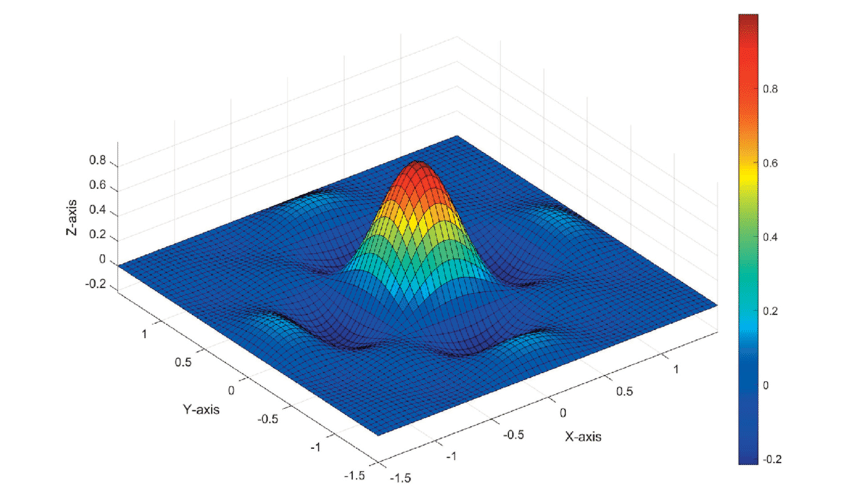

Project for the "**Symbolic and Evolutionary Artificial Intelligence**" class (2024-25) at Pisa University. 
Group work carried out by the students: [Luca Arduini](https://github.com/LucaArduini) and [Filippo Lucchesi](https://github.com/FilippoLucchesi).

# 🧠 MLP Hardware Accelerator in Verilog

This project presents the design and implementation of a **dedicated hardware accelerator for Multi-Layer Perceptron (MLP) inference**. Starting from a reference C++ model, we developed a synthesizable and parameterizable Verilog implementation, ready for deployment on FPGAs or ASICs.

The primary goal was to create a generic hardware engine capable of accelerating neural network computations, bridging the gap between high-level software models and efficient hardware execution.

## 🎯 Project Overview

The core of this project is the transformation of a software-based MLP into a physical hardware accelerator. The end-to-end process involved:
1.  **Software Modeling**: Developing C++ models for MLP training and inference, first using floating-point and then converting to a hardware-friendly fixed-point representation.
2.  **Hardware Design**: Architecting a modular and parallel Verilog implementation of the MLP.
3.  **Verification**: Creating a robust testbench environment to verify the hardware's correctness against the "golden" fixed-point software model.

### ✨ Use Case: sinc2D Function Approximation
As a specific use case, the network was trained to approximate the two-dimensional **sinc(x, y)** function. However, the resulting hardware is fully generic! By simply loading a new set of pre-trained weights, the accelerator can be used for any other task.

  

---

## 🛠️ Hardware Architecture & Modules

The accelerator is designed with a modular, bottom-up approach, ensuring scalability and reusability.

### Core Verilog Modules (`/Project/MLP_FPGA/MLP_IP/`)

1.  **`MLP_mac.v`** 🧮
    -   **Multiply-Accumulate Unit**: The fundamental arithmetic core of a neuron. It performs the `acc = acc + (a * b)` operation and is fully pipelined for high throughput.

2.  **`MLP_weight_mem.v`** 💾
    -   **Weight Memory**: A simple dual-port RAM designed to store the weights for a single neuron. It's optimized to map to on-chip BRAMs for fast access.

3.  **`MLP_layer_hidden.v`** / **`MLP_layer_output.v`** 🧠
    -   **Layer Modules**: These structural modules build a complete network layer by instantiating multiple MAC and Weight Memory units in parallel. They manage the data flow for an entire layer and include logic for activation functions (ReLU for the hidden layer, clipping for the output).

4.  **`MLP_main.v`** 👑
    -   **Top-Level Controller**: This module integrates the layer modules and orchestrates the entire inference process using a Finite State Machine (FSM). It provides a memory-mapped interface for an external system to:
        -   Load inputs and weights.
        -   Start the computation.
        -   Read the final results and status.

### 🧪 Verification
The `/Project/MLP_FPGA/Testbenches/` directory contains comprehensive SystemVerilog testbenches for each module. The top-level testbench (`MLP_main_inference_tb.sv`) verifies the entire hardware accelerator by comparing its output against the golden results generated by the C++ fixed-point model, ensuring bit-for-bit accuracy.

---

## 🚀 How to Use

1.  **Explore the C++ Models**: The C++ files in `/Project/` show the logic for training and fixed-point conversion. You can compile and run them to understand the software reference.
2.  **Simulate the Verilog Design**: Use a Verilog simulator (like ModelSim, VCS, or Verilator) to run the testbenches located in `/Project/MLP_FPGA/Testbenches/`. Start with `MLP_main_inference_tb.sv` to simulate a full inference cycle.
3.  **Synthesize the Design**: The Verilog code is synthesizable. You can use tools like Intel Quartus or AMD Vivado to synthesize the `MLP_main.v` module and see the hardware resource utilization.
